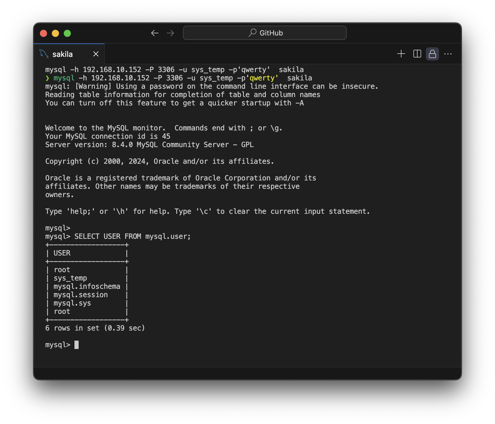
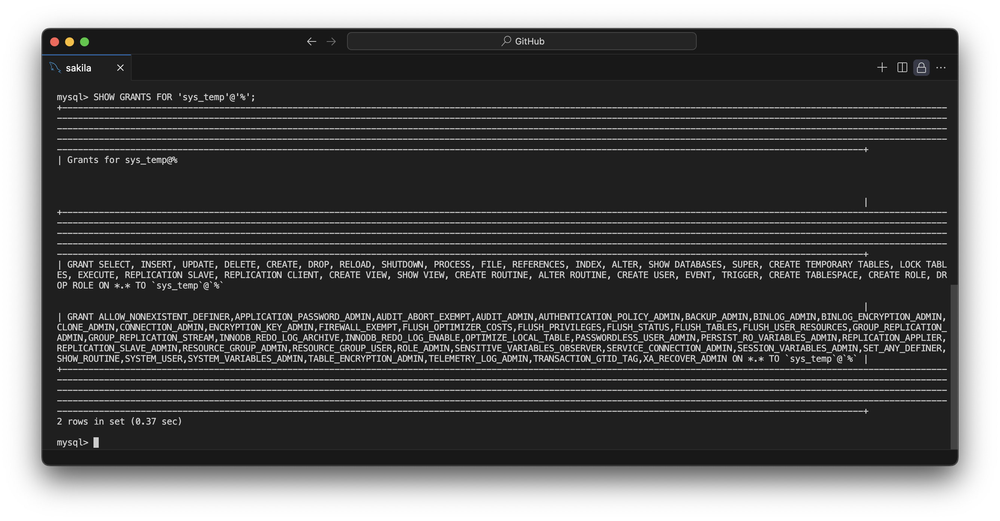
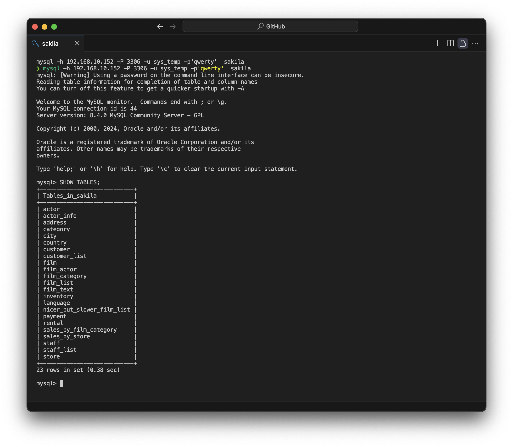

# Домашнее задание к занятию «Работа с данными (DDL/DML)»
Задание можно выполнить как в любом IDE, так и в командной строке.

### Задание 1
1.1. Поднимите чистый инстанс MySQL версии 8.0+. Можно использовать локальный сервер или контейнер Docker.

```yaml
version: '3'

services:
  mysql:
    image: mysql:latest
    container_name: mysql_sakila
    restart: always
    environment:
      MYSQL_ROOT_PASSWORD: 123
      MYSQL_DATABASE: sakila
    volumes:
      - ./mysql_data:/var/lib/mysql
    ports:
      - "3306:3306"
    networks:
      - mysql_network

networks:
  mysql_network:
    driver: bridge
```

1.2. Создайте учётную запись sys_temp.
```sql
CREATE USER 'sys_temp'@'%' IDENTIFIED BY 'qwerty';
```

1.3. Выполните запрос на получение списка пользователей в базе данных. (скриншот)
```sql
SELECT USER FROM mysql.user;
```

1.4. Дайте все права для пользователя sys_temp.
```sql
GRANT ALL PRIVILEGES ON *.* TO 'sys_temp'@'%';
FLUSH PRIVILEGES;
```

1.5. Выполните запрос на получение списка прав для пользователя sys_temp. (скриншот)
```sql
SHOW GRANTS FOR 'sys_temp'@'%';
```


1.6. Переподключитесь к базе данных от имени sys_temp.
```bash
mysql -h 192.168.10.152 -P 3306 -u sys_temp -p sakila
```

Для смены типа аутентификации с sha2 используйте запрос: 
```sql
ALTER USER 'sys_test'@'localhost' IDENTIFIED WITH mysql_native_password BY 'password';
```
1.6. По ссылке https://downloads.mysql.com/docs/sakila-db.zip скачайте дамп базы данных.

1.7. Восстановите дамп в базу данных.
```bash
mysql -h 192.168.10.152 -P 3306 -u sys_temp -p sakila < sakila-schema.sql
mysql -h 192.168.10.152 -P 3306 -u sys_temp -p sakila < sakila-data.sql
```

1.8. При работе в IDE сформируйте ER-диаграмму получившейся базы данных. При работе в командной строке используйте команду для получения всех таблиц базы данных. (скриншот)
```sql
SHOW TABLES;
```


*Результатом работы должны быть скриншоты обозначенных заданий, а также простыня со всеми запросами.*

### Простыня
```sql
CREATE USER 'sys_temp'@'%' IDENTIFIED BY 'qwerty';
SELECT USER FROM mysql.user;
GRANT ALL PRIVILEGES ON *.* TO 'sys_temp'@'%';
FLUSH PRIVILEGES;
SHOW GRANTS FOR 'sys_temp'@'%';
SHOW TABLES;
```

### Задание 2
Составьте таблицу, используя любой текстовый редактор или Excel, в которой должно быть два столбца: в первом должны быть названия таблиц восстановленной базы, во втором названия первичных ключей этих таблиц. Пример: (скриншот/текст)
```
Название таблицы | Название первичного ключа
customer         | customer_id
```

| Название таблицы | Название первичного ключа |
|------------------|---------------------------|
| actor | actor_id |
| address | address_id |
| category | category_id |
| city | city_id |
| country | country_id |
| customer | customer_id |
| film | film_id |
| film_actor | actor_id, film_id |
| film_category | film_id, category_id |
| film_text | film_id |
| inventory | inventory_id |
| language | language_id |
| payment | payment_id |
| rental | rental_id |
| staff | staff_id |
| store | store_id |

## Дополнительные задания (со звёздочкой*)
Эти задания дополнительные, то есть не обязательные к выполнению, и никак не повлияют на получение вами зачёта по этому домашнему заданию. Вы можете их выполнить, если хотите глубже шире разобраться в материале.

### Задание 3*
3.1. Уберите у пользователя sys_temp права на внесение, изменение и удаление данных из базы sakila.

3.2. Выполните запрос на получение списка прав для пользователя sys_temp. (скриншот)

*Результатом работы должны быть скриншоты обозначенных заданий, а также простыня со всеми запросами.*