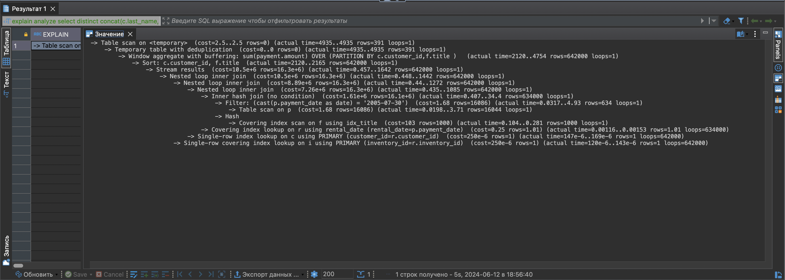
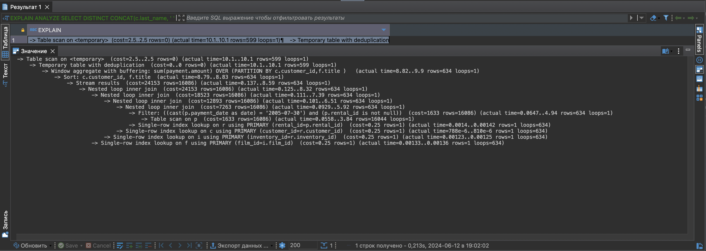

# Домашнее задание к занятию «Индексы»

### Задание 1
Напишите запрос к учебной базе данных, который вернёт процентное отношение общего размера всех индексов к общему размеру всех таблиц.
```sql
SELECT round(sum(index_length) / sum(data_length) * 100, 2) AS index_percent
FROM information_schema.tables
WHERE table_schema = 'sakila' 
AND table_type = 'BASE TABLE';
```

### Задание 2
Выполните explain analyze следующего запроса:
```sql
explain analyze
select distinct concat(c.last_name, ' ', c.first_name), sum(p.amount) over (partition by c.customer_id, f.title)
from payment p, rental r, customer c, inventory i, film f
where date(p.payment_date) = '2005-07-30' and p.payment_date = r.rental_date and r.customer_id = c.customer_id and i.inventory_id = r.inventory_id
```

### Результат: 5 секунд


- перечислите узкие места;
    * Использование старого синтаксиса через запятые. Рекомендуется использовать JOIN
    * В запросе несколько условий WHERE. Рекомендуется использовать ON совместно с JOIN

- оптимизируйте запрос: внесите корректировки по использованию операторов, при необходимости добавьте индексы.

```sql
explain analyze
SELECT DISTINCT 
    concat(c.last_name, ' ', c.first_name), 
    sum(p.amount) over (partition by c.customer_id, f.title)
FROM payment p
JOIN rental r ON p.rental_id = r.rental_id
JOIN customer c ON r.customer_id = c.customer_id
JOIN inventory i ON r.inventory_id = i.inventory_id
JOIN film f ON i.film_id = f.film_id
WHERE DATE(p.payment_date) = '2005-07-30';
```
### Результат: 213 мс



## Дополнительные задания (со звёздочкой*)
Эти задания дополнительные, то есть не обязательные к выполнению, и никак не повлияют на получение вами зачёта по этому домашнему заданию. Вы можете их выполнить, если хотите глубже шире разобраться в материале.

### Задание 3*

Самостоятельно изучите, какие типы индексов используются в PostgreSQL. Перечислите те индексы, которые используются в PostgreSQL, а в MySQL — нет.

*Приведите ответ в свободной форме.*