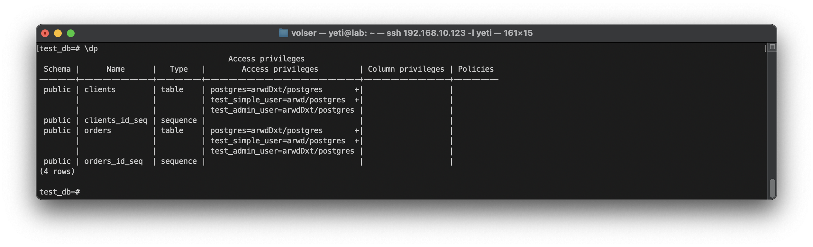

# Домашнее задание к занятию 2. «SQL»

## Введение

Перед выполнением задания вы можете ознакомиться с 
[дополнительными материалами](https://github.com/netology-code/virt-homeworks/blob/virt-11/additional/README.md).

## Задача 1

Используя Docker, поднимите инстанс PostgreSQL (версию 12) c 2 volume, 
в который будут складываться данные БД и бэкапы.

Приведите получившуюся команду или docker-compose-манифест.
```yaml
services:
  postgres:
    image: postgres:12
    container_name: postgres
    restart: always
    environment:
      POSTGRES_PASSWORD: $POSTGRES_PASSWORD
    volumes:
      - /opt/pgdata:/var/lib/postgresql/data
      - /opt/pgbackups:/backups
    networks:
      - pgnet
    ports:
      - 5432:5432

volumes:
  pgdata:
  pgbackups:

networks:
  pgnet:
    name: "pgnet"
```

## Задача 2

В БД из задачи 1: 

- создайте пользователя test-admin-user и БД test_db;
```sh
sudo docker exec -it postgres psql -U postgres
```
```sql
CREATE USER "test_admin_user" WITH PASSWORD '123';
CREATE DATABASE test_db;
```
- в БД test_db создайте таблицу orders и clients (спeцификация таблиц ниже);
```sh
\c test_db
```
```sql
CREATE TABLE IF NOT EXISTS orders (
    id SERIAL PRIMARY KEY,
    name_order VARCHAR(100) UNIQUE NOT NULL,
    price INTEGER NOT NULL
);

CREATE TABLE IF NOT EXISTS clients (
    id SERIAL PRIMARY KEY,
    surname VARCHAR(50) NOT NULL,
    country VARCHAR(30) NOT NULL,
    order_id INTEGER REFERENCES orders(id)
);

CREATE INDEX ON clients(country);
```
- предоставьте привилегии на все операции пользователю test-admin-user на таблицы БД test_db;
```sql
GRANT ALL PRIVILEGES ON ALL TABLES IN SCHEMA public TO "test_admin_user";
```
- создайте пользователя test-simple-user;
```sql
CREATE USER "test_simple_user" WITH PASSWORD '123';
```
- предоставьте пользователю test-simple-user права на SELECT/INSERT/UPDATE/DELETE этих таблиц БД test_db.
```sql
GRANT SELECT, INSERT, UPDATE, DELETE ON orders, clients TO "test_simple_user";
```
Таблица orders:

- id (serial primary key);
- наименование (string);
- цена (integer).

Таблица clients:

- id (serial primary key);
- фамилия (string);
- страна проживания (string, index);
- заказ (foreign key orders).

Приведите:

- итоговый список БД после выполнения пунктов выше;


- описание таблиц (describe);


- SQL-запрос для выдачи списка пользователей с правами над таблицами test_db;


- список пользователей с правами над таблицами test_db.



## Задача 3

Используя SQL-синтаксис, наполните таблицы следующими тестовыми данными:

Таблица orders

|Наименование|цена|
|------------|----|
|Шоколад| 10 |
|Принтер| 3000 |
|Книга| 500 |
|Монитор| 7000|
|Гитара| 4000|

```sql
INSERT INTO orders (name_order, price) VALUES
('Шоколад', 10),
('Принтер', 3000),
('Книга', 500),
('Монитор', 7000),
('Гитара', 4000);
```
Таблица clients

|ФИО|Страна проживания|
|------------|----|
|Иванов Иван Иванович| USA |
|Петров Петр Петрович| Canada |
|Иоганн Себастьян Бах| Japan |
|Ронни Джеймс Дио| Russia|
|Ritchie Blackmore| Russia|

```sql
INSERT INTO clients (surname, country) VALUES
('Иванов Иван Иванович', 'USA'),
('Петров Петр Петрович', 'Canada'),
('Иоганн Себастьян Бах', 'Japan'),
('Ронни Джеймс Дио', 'Russia'),
('Ritchie Blackmore', 'Russia');
```

Используя SQL-синтаксис:
- вычислите количество записей для каждой таблицы.


Приведите в ответе:

    - запросы,
    - результаты их выполнения.

## Задача 4

Часть пользователей из таблицы clients решили оформить заказы из таблицы orders.

Используя foreign keys, свяжите записи из таблиц, согласно таблице:

|ФИО|Заказ|
|------------|----|
|Иванов Иван Иванович| Книга |
|Петров Петр Петрович| Монитор |
|Иоганн Себастьян Бах| Гитара |

Приведите SQL-запросы для выполнения этих операций.
```sql
UPDATE clients SET order_id = 3 WHERE surname = 'Иванов Иван Иванович';
UPDATE clients SET order_id = 4 WHERE surname = 'Петров Петр Петрович'; 
UPDATE clients SET order_id = 5 WHERE surname = 'Иоганн Себастьян Бах';
```
Приведите SQL-запрос для выдачи всех пользователей, которые совершили заказ, а также вывод этого запроса.


Подсказка: используйте директиву `UPDATE`.

## Задача 5

Получите полную информацию по выполнению запроса выдачи всех пользователей из задачи 4 
(используя директиву EXPLAIN).

Приведите получившийся результат и объясните, что значат полученные значения.


- Seq Scan on clients - выполняет последовательное сканирование таблицы clients, просматривая каждую строку в таблице по порядку для выполнения условия запроса.

- cost - оценка стоимости выполнения запроса
    * 0.00 - затраты на получение первой строки
    * 13.50 - общая стоимость затрат на обработку всего запроса
    * rows=348 - приблизительное количество возвращаемых строк при выполнении операции Seq Scan
    * width=204 - средняя ширина в байтах каждой возвращаемой строки.

- Filter (order_id IS NOT NULL) - условие фильтрацииб запрос выбирает только те строки, где значение столбца order_id не является NULL.

## Задача 6

Создайте бэкап БД test_db и поместите его в volume, предназначенный для бэкапов (см. задачу 1).

```bash
sudo docker exec -it postgres bash
```
```bash
pg_dump -U postgres test_db > /backups/test_db.sql
```

Остановите контейнер с PostgreSQL, но не удаляйте volumes.

```
sudo docker compose down
```

Поднимите новый пустой контейнер с PostgreSQL.

```bash
sudo docker run -d \
	--name new-postgres \
	-e POSTGRES_PASSWORD=postgres \
	-e PGDATA=/var/lib/postgresql/data/pgdata \
	-v /opt/pgbackups:/backups \
	postgres:12
```
Восстановите БД test_db в новом контейнере.
```bash
sudo docker exec -it new-postgres psql -U postgres
```
```sql
CREATE DATABASE test_db;
```

```sql
CREATE USER "test_admin_user" WITH PASSWORD '123';
```
```sql
CREATE USER "test_simple_user" WITH PASSWORD '123';
```
```bash
sudo docker exec -it new-postgres bash
```
```bash
psql -U postgres -d test_db < /backups/test_db.sql
```

Приведите список операций, который вы применяли для бэкапа данных и восстановления. 

---

### Как cдавать задание

Выполненное домашнее задание пришлите ссылкой на .md-файл в вашем репозитории.

---

