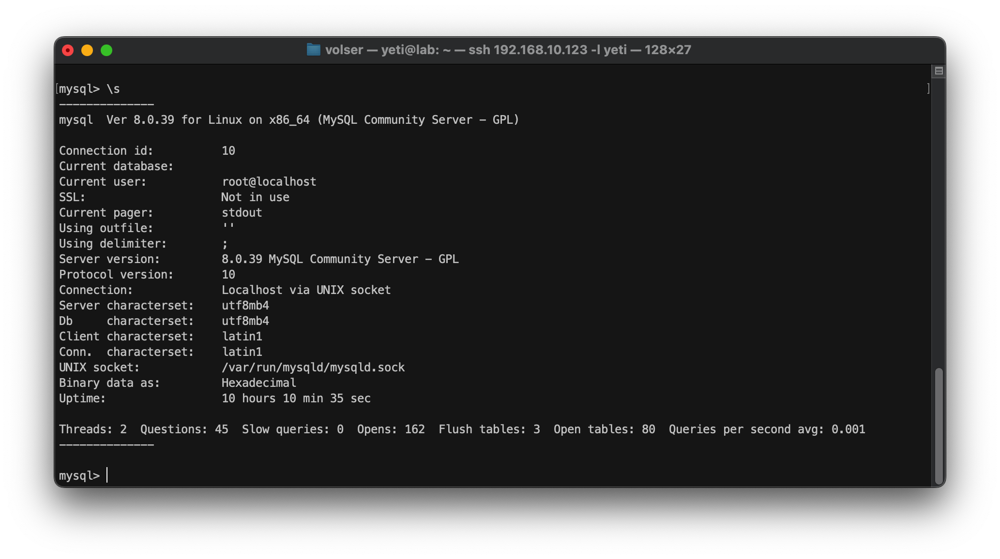
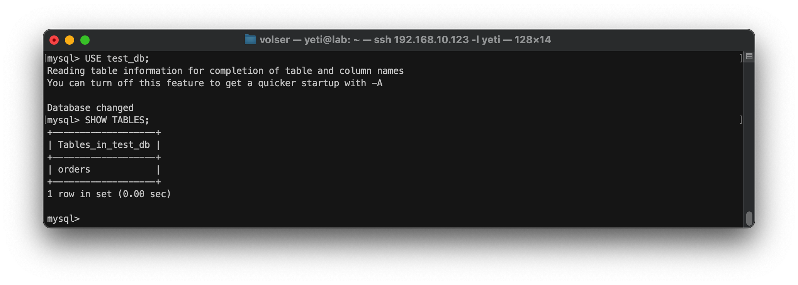
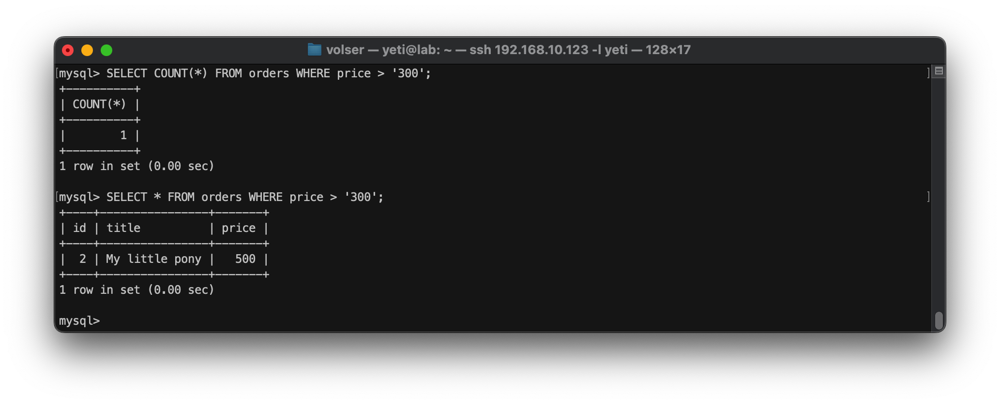
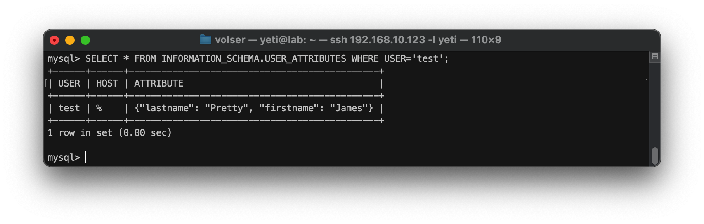
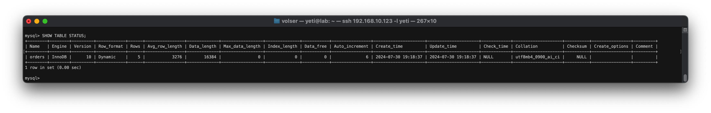
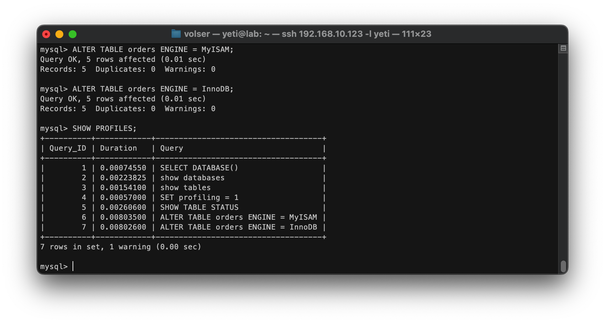

# Домашнее задание к занятию 3. «MySQL»

## Введение

Перед выполнением задания вы можете ознакомиться с 
[дополнительными материалами](https://github.com/netology-code/virt-homeworks/blob/virt-11/additional/README.md).

## Задача 1

Используя Docker, поднимите инстанс MySQL (версию 8). Данные БД сохраните в volume.
```sh
sudo docker run --name mysql -e MYSQL_ROOT_PASSWORD=Pass00word -v mysql-data:/var/lib/mysql -d mysql:8.0
```
Изучите [бэкап БД](https://github.com/netology-code/virt-homeworks/tree/virt-11/06-db-03-mysql/test_data) и 
восстановитесь из него.
```sh
wget https://raw.githubusercontent.com/netology-code/virt-homeworks/virt-11/06-db-03-mysql/test_data/test_dump.sql
```
```sh
sudo docker cp test_dump.sql mysql:/tmp/test_dump.sql
```
```sh
sudo docker exec -it mysql mysql -p
```
```sql
CREATE DATABASE test_db;
```
```sql
USE test_db;
```
```sql
SOURCE /tmp/test_dump.sql;
```
Перейдите в управляющую консоль `mysql` внутри контейнера.
```sh
sudo docker exec -it mysql mysql -p
```

Используя команду `\h`, получите список управляющих команд.

Найдите команду для выдачи статуса БД и **приведите в ответе** из её вывода версию сервера БД.



Подключитесь к восстановленной БД и получите список таблиц из этой БД.
```sql
USE test_db;
```
```sql
SHOW TABLES;
```



**Приведите в ответе** количество записей с `price` > 300.



В следующих заданиях мы будем продолжать работу с этим контейнером.

## Задача 2

Создайте пользователя test в БД c паролем test-pass, используя:

- плагин авторизации mysql_native_password
- срок истечения пароля — 180 дней 
- количество попыток авторизации — 3 
- максимальное количество запросов в час — 100
- аттрибуты пользователя:
    - Фамилия "Pretty"
    - Имя "James".

```sql
CREATE USER IF NOT EXISTS 'test'@'%' 
IDENTIFIED WITH mysql_native_password BY 'test-pass'
WITH MAX_QUERIES_PER_HOUR 100
PASSWORD EXPIRE INTERVAL 180 DAY
FAILED_LOGIN_ATTEMPTS 3
ATTRIBUTE '{"lastname":"Pretty", "firstname":"James"}';
```

Предоставьте привилегии пользователю `test` на операции SELECT базы `test_db`.

```sql
GRANT SELECT ON test_db.* TO 'test'@'%';
```

Используя таблицу INFORMATION_SCHEMA.USER_ATTRIBUTES, получите данные по пользователю `test` и 
**приведите в ответе к задаче**.

```sql
SELECT * FROM INFORMATION_SCHEMA.USER_ATTRIBUTES WHERE USER='test';
```



## Задача 3

Установите профилирование `SET profiling = 1`.
Изучите вывод профилирования команд `SHOW PROFILES;`.



Исследуйте, какой `engine` используется в таблице БД `test_db` и **приведите в ответе**.

Измените `engine` и **приведите время выполнения и запрос на изменения из профайлера в ответе**:
- на `MyISAM`,
- на `InnoDB`.



## Задача 4 

Изучите файл `my.cnf` в директории /etc/mysql.

Измените его согласно ТЗ (движок InnoDB):

- скорость IO важнее сохранности данных;
- нужна компрессия таблиц для экономии места на диске;
- размер буффера с незакомиченными транзакциями 1 Мб;
- буффер кеширования 30% от ОЗУ;
- размер файла логов операций 100 Мб.

Приведите в ответе изменённый файл `my.cnf`.
```
innodb_flush_method = O_DSYNC
innodb_flush_log_at_trx_commit = 0
innodb_file_per_table = 1
innodb_log_buffer_size = 1M
innodb_buffer_pool_size = 10G (Total 32G)
innodb_log_file_size = 100M
```

---

### Как оформить ДЗ

Выполненное домашнее задание пришлите ссылкой на .md-файл в вашем репозитории.

---