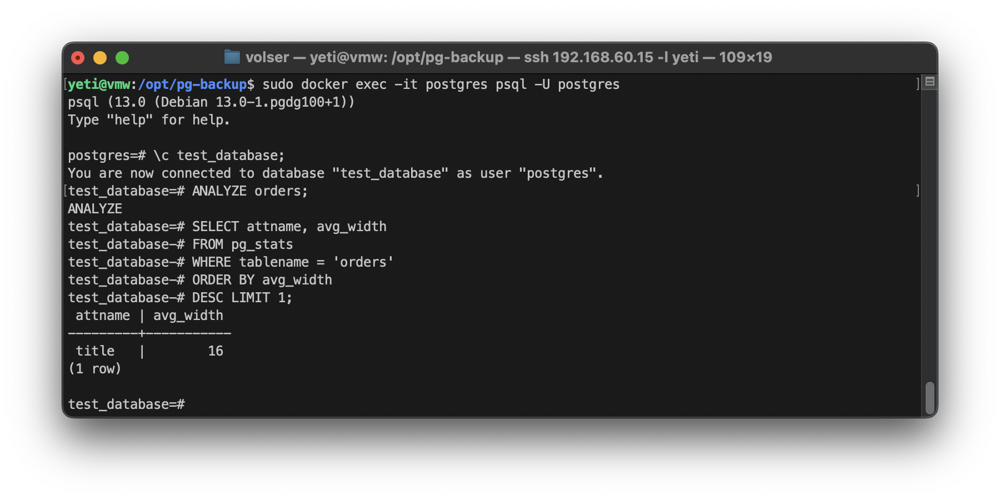
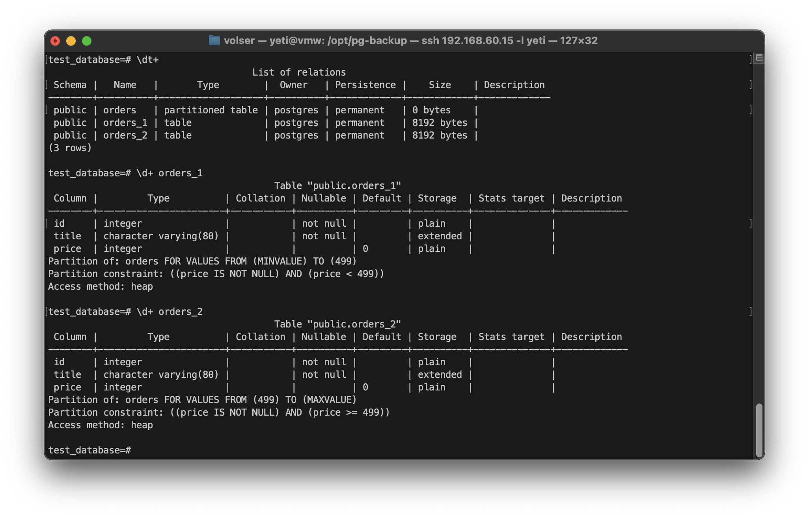
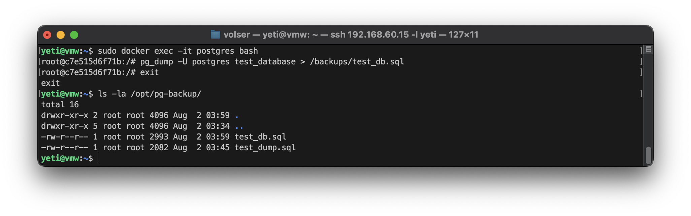

# Домашнее задание к занятию 4. «PostgreSQL»

## Задача 1

Используя Docker, поднимите инстанс PostgreSQL (версию 13). Данные БД сохраните в volume.
```
sudo docker run --name postgres \
  -e POSTGRES_PASSWORD=Pass00word \
  -v /opt/pg-data:/var/lib/postgresql/data \
  -v /opt/pg-backup:/backups \
  -d postgres:13.0
```
Подключитесь к БД PostgreSQL, используя `psql`.
```
sudo docker exec -it postgres psql -U postgres
```

Воспользуйтесь командой `\?` для вывода подсказки по имеющимся в `psql` управляющим командам.

**Найдите и приведите** управляющие команды для:

- вывода списка БД, - **`\l`**
- подключения к БД, - **`\c db_name`**
- вывода списка таблиц, - **`\dt`**
- вывода описания содержимого таблиц, - **`\d table_name`**
- выхода из psql. - **`\q`**

## Задача 2

Используя `psql`, создайте БД `test_database`.
```sql
CREATE DATABASE test_database;
```
Изучите [бэкап БД](https://github.com/netology-code/virt-homeworks/tree/virt-11/06-db-04-postgresql/test_data).
```sh
sudo wget https://raw.githubusercontent.com/netology-code/virt-homeworks/virt-11/06-db-04-postgresql/test_data/test_dump.sql /opt/pg-backup/test_dump.sql
```
Восстановите бэкап БД в `test_database`.
```sh
sudo docker exec -i postgres psql -U postgres -d test_database < test_dump.sql
```
Перейдите в управляющую консоль `psql` внутри контейнера.

Подключитесь к восстановленной БД и проведите операцию ANALYZE для сбора статистики по таблице.
```sql
\c test_database;
```
```sql
ANALYZE orders;
```
Используя таблицу [pg_stats](https://postgrespro.ru/docs/postgresql/12/view-pg-stats), найдите столбец таблицы `orders` 
с наибольшим средним значением размера элементов в байтах.
```sql
SELECT attname, avg_width
FROM pg_stats
WHERE tablename = 'orders'
ORDER BY avg_width
DESC LIMIT 1;
```

**Приведите в ответе** команду, которую вы использовали для вычисления, и полученный результат.



## Задача 3

Архитектор и администратор БД выяснили, что ваша таблица orders разрослась до невиданных размеров и
поиск по ней занимает долгое время. Вам как успешному выпускнику курсов DevOps в Нетологии предложили
провести разбиение таблицы на 2: шардировать на orders_1 - price>499 и orders_2 - price<=499.

Предложите SQL-транзакцию для проведения этой операции.
```
BEGIN;

CREATE TABLE orders_partition (
    id integer NOT NULL,
    title character varying(80) NOT NULL,
    price integer DEFAULT 0
)
PARTITION BY RANGE (price);

CREATE TABLE orders_1
    PARTITION OF orders_partition
    FOR VALUES FROM (MINVALUE) TO (499);

CREATE TABLE orders_2
    PARTITION OF orders_partition
    FOR VALUES FROM (499) TO (MAXVALUE);

INSERT INTO orders_partition SELECT * FROM orders;
   
DROP TABLE orders;
   
ALTER TABLE orders_partition RENAME TO orders;

COMMIT;
```


Можно ли было изначально исключить ручное разбиение при проектировании таблицы orders?

`Чтобы изначально исключить ручное разбиение, можно было использовать декларативное секционирование (partitioning) при создании таблицы orders.`

## Задача 4

Используя утилиту `pg_dump`, создайте бекап БД `test_database`.
```sh
sudo docker exec -it postgres bash
```
```sh
pg_dump -U postgres test_database > /backups/test_db.sql
```


Как бы вы доработали бэкап-файл, чтобы добавить уникальность значения столбца `title` для таблиц `test_database`?

`Можно добавить (UNIQUE) столбцу title в таблице orders:`
```sql
CREATE TABLE public.orders (
    id INTEGER NOT NULL,
    title CHARACTER VARYING(80) UNIQUE NOT NULL,
    price INTEGER DEFAULT 0
);

ALTER TABLE public.orders ADD CONSTRAINT orders_title_key UNIQUE (title);
```

---

### Как cдавать задание

Выполненное домашнее задание пришлите ссылкой на .md-файл в вашем репозитории.

---
