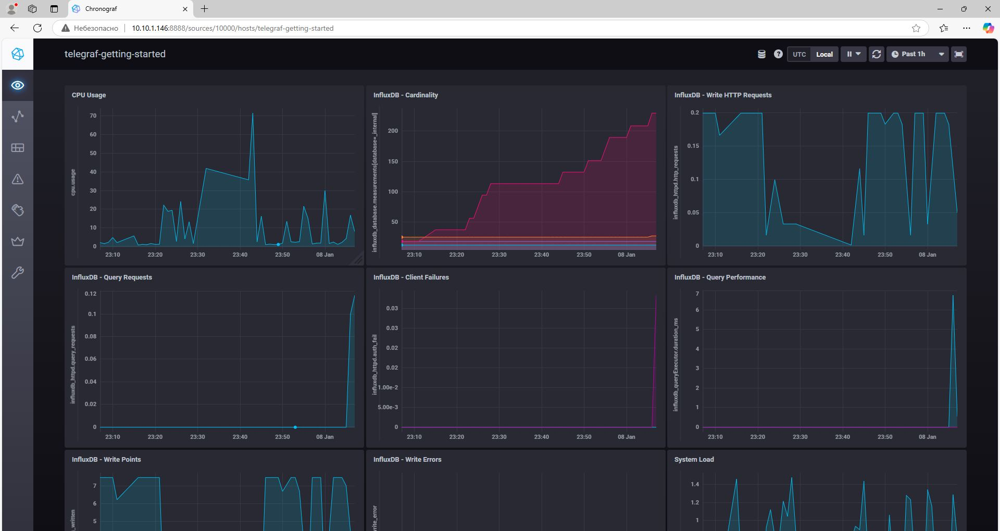
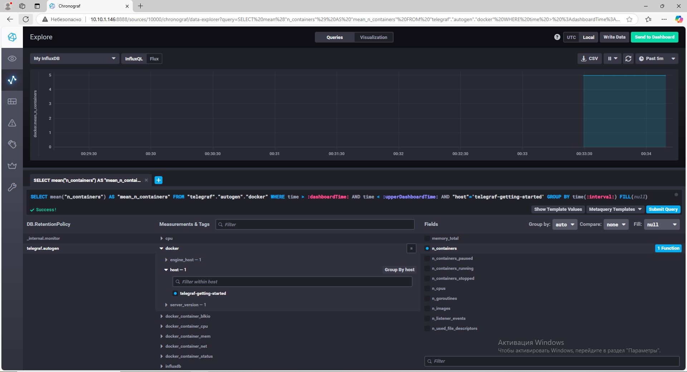

# Домашнее задание к занятию "13. Системы мониторинга"

## Обязательные задания

1. Вас пригласили настроить мониторинг на проект. На онбординге вам рассказали, что проект представляет из себя 
платформу для вычислений с выдачей текстовых отчетов, которые сохраняются на диск. Взаимодействие с платформой 
осуществляется по протоколу http. Также вам отметили, что вычисления загружают ЦПУ. Какой минимальный набор метрик вы
выведите в мониторинг и почему?
#### `Ответ:`
#### Мониторинг OS:
 - CPU:
    - CPU utilization
    - Load Average

 - RAM:
    - Memory utilization
    - Free swap space in %

 - DISK:
    - Space utilization
    - Free inodes in %
    - Disk write request avg waiting time
    - Disk read request avg waiting time

- NETWORK:
    - Загруженность интерфейсов (Bits received, Bits send)

#### Мониторинг App:
 - HTTP-запросы:
    - общее количество запросов
    - количество ошибочных запросов
    - время выполнения запросов (время отклика)
#
2. Менеджер продукта посмотрев на ваши метрики сказал, что ему непонятно что такое RAM/inodes/CPUla. Также он сказал, 
что хочет понимать, насколько мы выполняем свои обязанности перед клиентами и какое качество обслуживания. Что вы можете ему предложить?

#### `Ответ:`
- **RAM** – оперативная память, которая нужна для обработки вычислений. Если ее мало, система может замедлиться.
- **CPU load average (CPUla)** – показатель загрузки процессора. Если значение близко к количеству ядер, процессор перегружен.
- **Inodes** – структура данных для хранения информации о файлах. Если inodes заканчиваются, создание новых файлов становится невозможным, что может повлиять на работу платформы.

Объясним менеджеру на его языке. Свяжем тех. метрики с бизнес-составляющей: SLO SLA SLI.

- SLA - Если клиент не получил ожидаемый ответ от приложения, то значит бизнес бизнес несет убытки. Гарантируем, что ожидаемый ответ от приложения составляет не более 5 секунд.
- SLO - Если мы заявляем, что 99% пользователей получат в нужный срок ожидаемый ответ от приложения. 1% - техническое обслуживание.
- SLI : Расчет по ответу от приложения клиенту. Успех: Запрос должен отдавать 200ые или 300ые коды в течение 5 секунд. Неудача: нарушение любого условия (ответ или время)
```
SLI = (summ_2xx_requests_less_than_5_sec + summ_3xx_requests_less_than_5_sec) / (summ_all_requests)
```
#
3. Вашей DevOps команде в этом году не выделили финансирование на построение системы сбора логов. Разработчики в свою 
очередь хотят видеть все ошибки, которые выдают их приложения. Какое решение вы можете предпринять в этой ситуации, 
чтобы разработчики получали ошибки приложения?
#### `Ответ:`
Можно использовать Sentry - он бесплатный  
Sentry — это инструмент мониторинга и отслеживания ошибок для приложений, который помогает разработчикам обнаруживать и устранять баги в реальном времени. 
#
4. Вы, как опытный SRE, сделали мониторинг, куда вывели отображения выполнения SLA=99% по http кодам ответов. 
Вычисляете этот параметр по следующей формуле: summ_2xx_requests/summ_all_requests. Данный параметр не поднимается выше 
70%, но при этом в вашей системе нет кодов ответа 5xx и 4xx. Где у вас ошибка?

#### `Ответ:`
Нужно добавить коды ответов 1xx и 3xx:
```
SLA = (summ_2xx_requests + summ_1xx_requests + summ_3xx_requests) / summ_all_requests
```
#
5. Опишите основные плюсы и минусы pull и push систем мониторинга.
#### `Ответ:`


#### Pull-модель:
**Плюсы:**
- Простая настройка: метрики собираются с известных эндпоинтов.
- Высокая гибкость: можно собирать метрики только с нужных источников.
- Безопасность: сервер мониторинга инициирует запросы.

**Минусы:**
- Не подходит для динамически изменяющихся сред (например, контейнеров).
- Может вызывать нагрузку на источник данных при большом количестве запросов.

#### Push-модель:
**Плюсы:**
- Подходит для динамических сред, где количество метрик меняется.
- Меньше нагрузка на источники данных, так как они сами отправляют метрики.

**Минусы:**
- Требуется больше настроек для отправки данных.
- Возможны проблемы с безопасностью (нужно доверять отправителю данных).

#
6. Какие из ниже перечисленных систем относятся к push модели, а какие к pull? А может есть гибридные?

    - Prometheus - PULL / PUSH через Pushgateway
    - TICK - PUSH
    - Zabbix - PUSH/PULL
    - VictoriaMetrics - PUSH/PULL
    - Nagios - PULL
#
7. Склонируйте себе [репозиторий](https://github.com/influxdata/sandbox/tree/master) и запустите TICK-стэк, 
используя технологии docker и docker-compose.

В виде решения на это упражнение приведите скриншот веб-интерфейса ПО chronograf (`http://localhost:8888`). 

P.S.: если при запуске некоторые контейнеры будут падать с ошибкой - проставьте им режим `Z`, например
`./data:/var/lib:Z`  

  
#
8. Перейдите в веб-интерфейс Chronograf (http://localhost:8888) и откройте вкладку Data explorer.
        
    - Нажмите на кнопку Add a query
    - Изучите вывод интерфейса и выберите БД telegraf.autogen
    - В `measurments` выберите cpu->host->telegraf-getting-started, а в `fields` выберите usage_system. Внизу появится график утилизации cpu.
    - Вверху вы можете увидеть запрос, аналогичный SQL-синтаксису. Поэкспериментируйте с запросом, попробуйте изменить группировку и интервал наблюдений.

Для выполнения задания приведите скриншот с отображением метрик утилизации cpu из веб-интерфейса.
#
9. Изучите список [telegraf inputs](https://github.com/influxdata/telegraf/tree/master/plugins/inputs). 
Добавьте в конфигурацию telegraf следующий плагин - [docker](https://github.com/influxdata/telegraf/tree/master/plugins/inputs/docker):
```
[[inputs.docker]]
  endpoint = "unix:///var/run/docker.sock"
```

Дополнительно вам может потребоваться донастройка контейнера telegraf в `docker-compose.yml` дополнительного volume и 
режима privileged:
```
  telegraf:
    image: telegraf:1.4.0
    privileged: true
    volumes:
      - ./etc/telegraf.conf:/etc/telegraf/telegraf.conf:Z
      - /var/run/docker.sock:/var/run/docker.sock:Z
    links:
      - influxdb
    ports:
      - "8092:8092/udp"
      - "8094:8094"
      - "8125:8125/udp"
```
  

После настройке перезапустите telegraf, обновите веб интерфейс и приведите скриншотом список `measurments` в 
веб-интерфейсе базы telegraf.autogen . Там должны появиться метрики, связанные с docker.

Факультативно можете изучить какие метрики собирает telegraf после выполнения данного задания.

## Дополнительное задание (со звездочкой*) - необязательно к выполнению

1. Вы устроились на работу в стартап. На данный момент у вас нет возможности развернуть полноценную систему 
мониторинга, и вы решили самостоятельно написать простой python3-скрипт для сбора основных метрик сервера. Вы, как 
опытный системный-администратор, знаете, что системная информация сервера лежит в директории `/proc`. 
Также, вы знаете, что в системе Linux есть  планировщик задач cron, который может запускать задачи по расписанию.

Суммировав все, вы спроектировали приложение, которое:
- является python3 скриптом
- собирает метрики из папки `/proc`
- складывает метрики в файл 'YY-MM-DD-awesome-monitoring.log' в директорию /var/log 
(YY - год, MM - месяц, DD - день)
- каждый сбор метрик складывается в виде json-строки, в виде:
  + timestamp (временная метка, int, unixtimestamp)
  + metric_1 (метрика 1)
  + metric_2 (метрика 2)
  
     ...
     
  + metric_N (метрика N)
  
- сбор метрик происходит каждую 1 минуту по cron-расписанию

Для успешного выполнения задания нужно привести:

а) работающий код python3-скрипта,

б) конфигурацию cron-расписания,

в) пример верно сформированного 'YY-MM-DD-awesome-monitoring.log', имеющий не менее 5 записей,

P.S.: количество собираемых метрик должно быть не менее 4-х.
P.P.S.: по желанию можно себя не ограничивать только сбором метрик из `/proc`.

2. В веб-интерфейсе откройте вкладку `Dashboards`. Попробуйте создать свой dashboard с отображением:

    - утилизации ЦПУ
    - количества использованного RAM
    - утилизации пространства на дисках
    - количество поднятых контейнеров
    - аптайм
    - ...
    - фантазируйте)
    
    ---

### Как оформить ДЗ?

Выполненное домашнее задание пришлите ссылкой на .md-файл в вашем репозитории.

---
