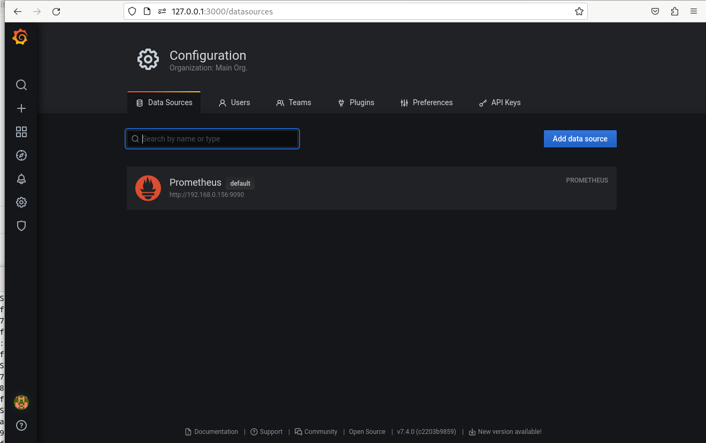
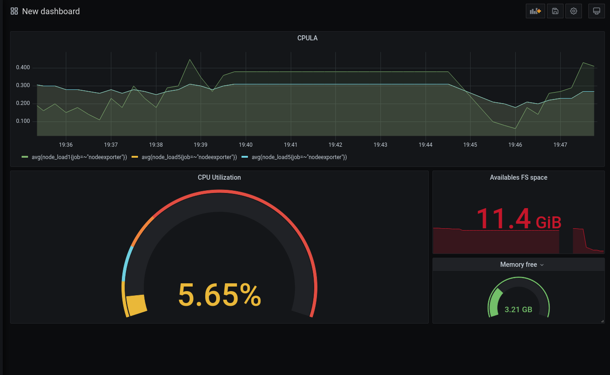
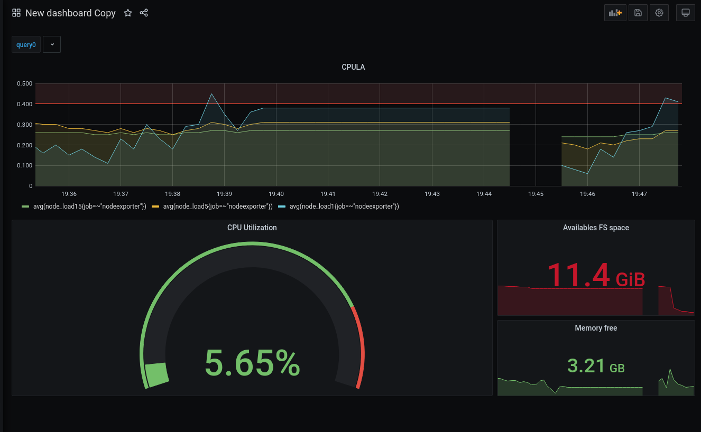
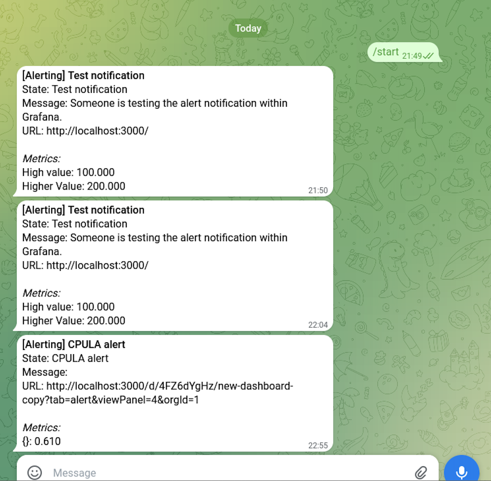

# Домашнее задание к занятию 14 «Средство визуализации Grafana»

## Задание повышенной сложности

**При решении задания 1** не используйте директорию [help](./help) для сборки проекта. Самостоятельно разверните grafana, где в роли источника данных будет выступать prometheus, а сборщиком данных будет node-exporter:

- grafana;
- prometheus-server;
- prometheus node-exporter.

За дополнительными материалами можете обратиться в официальную документацию grafana и prometheus.

В решении к домашнему заданию также приведите все конфигурации, скрипты, манифесты, которые вы 
использовали в процессе решения задания.

**При решении задания 3** вы должны самостоятельно завести удобный для вас канал нотификации, например, Telegram или email, и отправить туда тестовые события.

В решении приведите скриншоты тестовых событий из каналов нотификаций.

## Обязательные задания

### Задание 1

1. Используя директорию [help](./help) внутри этого домашнего задания, запустите связку prometheus-grafana.
1. Зайдите в веб-интерфейс grafana, используя авторизационные данные, указанные в манифесте docker-compose.
1. Подключите поднятый вами prometheus, как источник данных.
1. Решение домашнего задания — скриншот веб-интерфейса grafana со списком подключенных Datasource.  
  
## Задание 2

Изучите самостоятельно ресурсы:

1. [PromQL tutorial for beginners and humans](https://valyala.medium.com/promql-tutorial-for-beginners-9ab455142085).
1. [Understanding Machine CPU usage](https://www.robustperception.io/understanding-machine-cpu-usage).
1. [Introduction to PromQL, the Prometheus query language](https://grafana.com/blog/2020/02/04/introduction-to-promql-the-prometheus-query-language/).

Создайте Dashboard и в ней создайте Panels:

- утилизация CPU для nodeexporter (в процентах, 100-idle);  
```ini
100 - (avg (rate(node_cpu_seconds_total{job=~"nodeexporter",mode="idle"}[1m])) * 100)
```
- CPULA 1/5/15;  
```ini
avg(node_load1{job=~"nodeexporter"})
avg(node_load5{job=~"nodeexporter"})
avg(node_load15{job=~"nodeexporter"})
```
- количество свободной оперативной памяти;  
```ini
node_memory_MemFree_bytes{job=~"nodeexporter"}
```
- количество места на файловой системе.
```ini
node_filesystem_avail_bytes{job=~"nodeexporter",mountpoint="/",fstype!="rootfs"}
```

Для решения этого задания приведите promql-запросы для выдачи этих метрик, а также скриншот получившейся Dashboard.  


## Задание 3

1. Создайте для каждой Dashboard подходящее правило alert — можно обратиться к первой лекции в блоке «Мониторинг».
1. В качестве решения задания приведите скриншот вашей итоговой Dashboard.  
  
  

## Задание 4

1. Сохраните ваш Dashboard.Для этого перейдите в настройки Dashboard, выберите в боковом меню «JSON MODEL». Далее скопируйте отображаемое json-содержимое в отдельный файл и сохраните его.
1. В качестве решения задания приведите листинг этого файла.

<details>
  <summary>JSON MODEL </summary>

```json
{
  "annotations": {
    "list": [
      {
        "builtIn": 1,
        "datasource": "-- Grafana --",
        "enable": true,
        "hide": true,
        "iconColor": "rgba(0, 211, 255, 1)",
        "name": "Annotations & Alerts",
        "type": "dashboard"
      }
    ]
  },
  "editable": true,
  "gnetId": null,
  "graphTooltip": 0,
  "id": 1,
  "iteration": 1727207900914,
  "links": [],
  "panels": [
    {
      "alert": {
        "alertRuleTags": {},
        "conditions": [
          {
            "evaluator": {
              "params": [
                0.5
              ],
              "type": "gt"
            },
            "operator": {
              "type": "and"
            },
            "query": {
              "params": [
                "A",
                "10s",
                "now"
              ]
            },
            "reducer": {
              "params": [],
              "type": "avg"
            },
            "type": "query"
          }
        ],
        "executionErrorState": "alerting",
        "for": "5m",
        "frequency": "1m",
        "handler": 1,
        "name": "CPULA alert",
        "noDataState": "no_data",
        "notifications": [
          {
            "uid": "3r0G2LgNk"
          }
        ]
      },
      "aliasColors": {},
      "bars": false,
      "dashLength": 10,
      "dashes": false,
      "datasource": null,
      "fieldConfig": {
        "defaults": {
          "color": {},
          "custom": {},
          "thresholds": {
            "mode": "absolute",
            "steps": []
          }
        },
        "overrides": []
      },
      "fill": 1,
      "fillGradient": 0,
      "gridPos": {
        "h": 8,
        "w": 17,
        "x": 0,
        "y": 0
      },
      "hiddenSeries": false,
      "id": 4,
      "legend": {
        "avg": false,
        "current": false,
        "max": false,
        "min": false,
        "show": true,
        "total": false,
        "values": false
      },
      "lines": true,
      "linewidth": 1,
      "nullPointMode": "null",
      "options": {
        "alertThreshold": true
      },
      "percentage": false,
      "pluginVersion": "7.4.0",
      "pointradius": 2,
      "points": false,
      "renderer": "flot",
      "seriesOverrides": [],
      "spaceLength": 10,
      "stack": false,
      "steppedLine": false,
      "targets": [
        {
          "expr": "avg(node_load15{job=~\"nodeexporter\"})",
          "interval": "",
          "legendFormat": "",
          "refId": "A"
        },
        {
          "expr": "avg(node_load5{job=~\"nodeexporter\"})",
          "hide": false,
          "interval": "",
          "legendFormat": "",
          "refId": "B"
        },
        {
          "expr": "avg(node_load1{job=~\"nodeexporter\"})",
          "hide": false,
          "interval": "",
          "legendFormat": "",
          "refId": "D"
        }
      ],
      "thresholds": [
        {
          "colorMode": "critical",
          "fill": true,
          "line": true,
          "op": "gt",
          "value": 0.5,
          "visible": true
        }
      ],
      "timeFrom": null,
      "timeRegions": [],
      "timeShift": null,
      "title": "CPULA",
      "tooltip": {
        "shared": true,
        "sort": 0,
        "value_type": "individual"
      },
      "transformations": [],
      "transparent": true,
      "type": "graph",
      "xaxis": {
        "buckets": null,
        "mode": "time",
        "name": null,
        "show": true,
        "values": []
      },
      "yaxes": [
        {
          "format": "short",
          "label": null,
          "logBase": 1,
          "max": null,
          "min": null,
          "show": true
        },
        {
          "format": "short",
          "label": null,
          "logBase": 1,
          "max": null,
          "min": null,
          "show": true
        }
      ],
      "yaxis": {
        "align": false,
        "alignLevel": null
      }
    },
    {
      "datasource": null,
      "description": "",
      "fieldConfig": {
        "defaults": {
          "color": {
            "mode": "thresholds"
          },
          "custom": {},
          "mappings": [],
          "thresholds": {
            "mode": "absolute",
            "steps": [
              {
                "color": "green",
                "value": null
              },
              {
                "color": "#E24D42",
                "value": 80
              }
            ]
          },
          "unit": "percent"
        },
        "overrides": []
      },
      "gridPos": {
        "h": 9,
        "w": 12,
        "x": 0,
        "y": 8
      },
      "id": 2,
      "options": {
        "reduceOptions": {
          "calcs": [],
          "fields": "",
          "values": false
        },
        "showThresholdLabels": false,
        "showThresholdMarkers": true,
        "text": {}
      },
      "pluginVersion": "7.4.0",
      "targets": [
        {
          "exemplar": false,
          "expr": "100 - (avg (rate(node_cpu_seconds_total{job=~\"nodeexporter\",mode=\"idle\"}[1m])) * 100)",
          "instant": false,
          "interval": "",
          "legendFormat": "",
          "refId": "A"
        }
      ],
      "title": "CPU Utilization",
      "type": "gauge"
    },
    {
      "datasource": null,
      "fieldConfig": {
        "defaults": {
          "color": {
            "mode": "thresholds"
          },
          "custom": {},
          "mappings": [],
          "thresholds": {
            "mode": "absolute",
            "steps": [
              {
                "color": "dark-red",
                "value": null
              }
            ]
          },
          "unit": "bytes"
        },
        "overrides": []
      },
      "gridPos": {
        "h": 5,
        "w": 5,
        "x": 12,
        "y": 8
      },
      "id": 8,
      "options": {
        "colorMode": "value",
        "graphMode": "area",
        "justifyMode": "auto",
        "orientation": "auto",
        "reduceOptions": {
          "calcs": [
            "lastNotNull"
          ],
          "fields": "",
          "values": false
        },
        "text": {},
        "textMode": "auto"
      },
      "pluginVersion": "7.4.0",
      "targets": [
        {
          "expr": "node_filesystem_avail_bytes{job=~\"nodeexporter\",mountpoint=\"/\",fstype!=\"rootfs\"}",
          "interval": "",
          "legendFormat": "",
          "refId": "A"
        }
      ],
      "title": "Availables FS space",
      "type": "stat"
    },
    {
      "datasource": null,
      "description": "",
      "fieldConfig": {
        "defaults": {
          "color": {
            "mode": "thresholds"
          },
          "custom": {},
          "mappings": [],
          "thresholds": {
            "mode": "absolute",
            "steps": [
              {
                "color": "green",
                "value": null
              }
            ]
          },
          "unit": "decbytes"
        },
        "overrides": []
      },
      "gridPos": {
        "h": 4,
        "w": 5,
        "x": 12,
        "y": 13
      },
      "id": 6,
      "options": {
        "colorMode": "value",
        "graphMode": "area",
        "justifyMode": "auto",
        "orientation": "auto",
        "reduceOptions": {
          "calcs": [
            "lastNotNull"
          ],
          "fields": "",
          "values": false
        },
        "text": {},
        "textMode": "auto"
      },
      "pluginVersion": "7.4.0",
      "targets": [
        {
          "expr": "node_memory_MemFree_bytes{job=~\"nodeexporter\"}",
          "interval": "",
          "legendFormat": "",
          "refId": "A"
        }
      ],
      "timeFrom": null,
      "timeShift": null,
      "title": "Memory free",
      "type": "stat"
    }
  ],
  "refresh": "5s",
  "schemaVersion": 27,
  "style": "dark",
  "tags": [],
  "templating": {
    "list": [
      {
        "allValue": null,
        "current": {},
        "datasource": null,
        "definition": "",
        "description": null,
        "error": null,
        "hide": 0,
        "includeAll": false,
        "label": null,
        "multi": false,
        "name": "query0",
        "options": [],
        "query": "",
        "refresh": 0,
        "regex": "",
        "skipUrlSync": false,
        "sort": 0,
        "tagValuesQuery": "",
        "tags": [],
        "tagsQuery": "",
        "type": "query",
        "useTags": false
      }
    ]
  },
  "time": {
    "from": "2024-09-24T16:16:39.000Z",
    "to": "2024-09-24T17:06:31.000Z"
  },
  "timepicker": {},
  "timezone": "",
  "title": "New dashboard Copy",
  "uid": "4FZ6dYgHz",
  "version": 9
}
```

</details>

---

### Как оформить решение задания

Выполненное домашнее задание пришлите в виде ссылки на .md-файл в вашем репозитории.

---